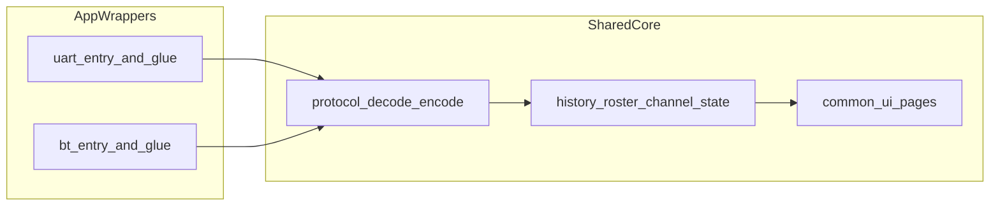

# FlipMesh Split Apps Plan (UART + BT)

## Цель
Разделить проект на два независимых приложения в репозитории:
- `apps/uart` — текущий рабочий UART-вариант
- `apps/bt` — новый BLE-вариант

При этом общий код (`protocol`, `roster`, `history`, `channel`, `notify`, общие типы и helpers) должен жить в едином shared core, чтобы не дублировать бизнес-логику.

## Архитектурный подход
- Работать в отдельной feature-ветке (без изменений `main`).
- Сформировать архитектуру `shared_core + app_wrappers`, а не два полных дубликата.
- В shared core оставить транспортно-независимую обработку `ToRadio/FromRadio`.
- В app-обвязках оставить только специфичное:
  - `uart` app: serial open/close/reopen + framing header.
  - `bt` app: scan/connect/disconnect + `ToRadio/FromRadio/FromNum` GATT цикл.

## Целевая структура
- `apps/uart/` — `application.fam`, entrypoint, UART transport glue, UART-specific settings UI.
- `apps/bt/` — `application.fam`, entrypoint, BLE transport glue, BLE scan/connect settings UI.
- `core/` (или `shared/`) — общий runtime:
  - `protocol`, `history`, `roster`, `channel`, `position`, `notify`,
  - общие типы/константы,
  - общие UI-компоненты страниц, где нет transport-specific поведения.
- `docs/` — описание split-архитектуры и тест-матрицы для двух приложений.

## Поток данных после разделения

## Cross-cutting: App manifest и layout

Фиксируется один раз и используется всеми этапами.

- `appid` и `entry_point`:
  - UART app: `appid="flipmesh_uart"`, `entry_point="flipmesh_uart_app_entry"`.
  - BT app: `appid="flipmesh_bt"`, `entry_point="flipmesh_bt_app_entry"`.
  - Разные `appid` обязательны, иначе Flipper установит только одну версию.
- `fap_icon`:
  - UART: текущая иконка.
  - BT: отдельная иконка, визуально отличимая в меню.
- Settings path (раздельные, чтобы не пересекались):
  - UART: `/ext/flipmesh/settings.cfg` (сохранить текущий путь ради обратной совместимости существующих пользователей).
  - BT: `/ext/flipmesh-bt/settings.cfg`.
- Shared code:
  - Каноническое имя каталога — `core/` (не `shared/`), используется всюду в плане и коде.
  - `core/lib/` (nanopb + meshtastic_api) подключается из обоих `application.fam` через `fap_private_libs` с относительными путями.
- uFBT workspace:
  - Каждый app имеет собственный `application.fam` в своём `apps/<name>/` каталоге.
  - `ufbt build` вызывается из соответствующей папки.
  - `core/` не содержит своего `application.fam`.
- Stack/memory:
  - UART app: `stack_size=10*1024` (как сейчас).
  - BT app: пересмотреть, вероятно повысить (например 12–16 KB) после Stage 0 spike, финальное значение зафиксировать на этапе 5.
- CI:
  - Изменяется один файл: [.github/workflows/build.yml](/home/user/Documents/Meshtastic/ZeroMesh/flipmesh/.github/workflows/build.yml).
  - Два отдельных job: UART build, BT build; оба обязательны для merge.
- Tests / stubs:
  - `tests/stubs/` остаётся в корне репозитория, используется на уровне unit-утилит (не привязан к конкретному app).

## Разделение state machines (важно для согласованности)

- Protocol state (общий, живёт в `core`): `FM_CONN_IDLE -> SYNC -> LIVE` (текущее поведение `want_config_id` / `config_complete_id`).
- Transport state (живёт в app-wrapper):
  - UART app: управляется внутри wrapper, наружу по сути всегда `ready` при открытом serial.
  - BT app: `idle / scanning / device_selected / connecting / connected / reconnecting / error`.
- Правила:
  - Core не знает о transport state, только получает сигналы «готов / не готов отправлять».
  - App-wrapper не знает о protocol state и не дублирует FSM synchronization.
  - Транспорт сообщает core о готовности через явный callback (`core_on_transport_ready/not_ready`), а core решает, когда стартовать sync.
- В BT app, состояние `connected_live` (из этапа 5) **не** означает Meshtastic LIVE — это только состояние BLE-линка. Meshtastic LIVE остаётся ответственностью `core`.

## Heartbeat policy по транспортам

- UART: heartbeat нужен из-за serial timeout Meshtastic — поведение как сейчас.
- BT: heartbeat по BLE обычно не требуется; по умолчанию отключён. Оставить опцию в настройках, но дефолт = off.
- Heartbeat timer lifecycle переезжает в `core` (это protocol-level поведение), но его активность включается/выключается app-wrapper через core API.

## Пошаговый план

### 0) BLE feasibility spike (блокирующий gate)

Цель: подтвердить, что BLE GATT client из external FAP действительно поддерживается на текущей прошивке Flipper, до любой реструктуризации.

- [ ] Прототип в одной-двух ветках кода без модификации основного приложения.
- [ ] Проверить доступность BLE central/GATT client через публичный SDK Flipper (`furi_hal_bt*`, профили).
- [ ] Подтвердить сценарий:
  - [ ] скан Meshtastic service UUID `6ba1b218-15a8-461f-9fa8-5dcae273eafd`;
  - [ ] connect к устройству;
  - [ ] write в `ToRadio` (`f75c76d2-129e-4dad-a1dd-7866124401e7`);
  - [ ] subscribe/notify на `FromNum` (`ed9da18c-a800-4f66-a670-aa7547e34453`);
  - [ ] read `FromRadio` (`2c55e69e-4993-11ed-b878-0242ac120002`).
- [ ] Зафиксировать MTU (цель 512) и реальные ограничения в этом стеке.
- [ ] Результат: короткий отчёт go / no-go + список ограничений и зависимостей (версия прошивки, сторонние компоненты, API).
- [ ] Выход: при no-go — зафиксировать альтернативу (custom firmware / сторонний стек) и не переходить к этапам 2+ без решения.

### 1) Подготовка ветки и baseline
- Создать feature-ветку для split-работы.
- Зафиксировать текущий UART baseline как эталон поведения (smoke checklist: connect/sync/send/receive/logs/settings).

#### 1.1 Детальный execution-чеклист первого этапа
- [ ] Убедиться, что Stage 0 (BLE feasibility spike) завершён с результатом go. Если no-go — остановиться и согласовать альтернативу с пользователем.
- [ ] Создать ветку вида `feat/split-uart-bt-apps` от текущего актуального `main`.
- [ ] Зафиксировать текущий статус сборки UART (`ufbt build`) как baseline.
- [ ] Прогнать ручной smoke-check UART и записать результат в `docs/baseline-uart.md`:
  - [ ] app стартует без ошибок;
  - [ ] `Syncing...` -> `Connected`;
  - [ ] отправка сообщения работает;
  - [ ] входящее сообщение отображается в истории;
  - [ ] страницы `Nodes/Stats/Signal/Logs/Settings` работают без зависаний;
  - [ ] изменение `UART/Baud` в Settings сохраняется и применяется.
- [ ] Сохранить baseline-артефакты (короткий лог + список проверенных сценариев), чтобы сравнивать после реструктуризации.

#### 1.2 Что должно быть готово после этапа 1
- Рабочая feature-ветка создана.
- Есть подтверждённый UART baseline (build + smoke).
- Есть документ baseline для последующей регрессионной проверки после каждого крупного шага миграции.

### 2) Реструктуризация каталогов
- Перенести текущий single-app layout в `apps/uart` + `core` без изменения runtime-поведения.
- Настроить сборку так, чтобы UART-приложение продолжало успешно собираться как отдельный app target.

#### 2.1 Целевая минимальная структура после этапа 2
- `apps/uart/`
  - `application.fam`
  - `fm_app.c` (entrypoint для UART app)
  - transport glue для UART (пока без изменения поведения)
  - app-specific ресурсы (`icons/`, локальные app-описания)
- `core/`
  - `flipmesh.h` (или `core/app_context.h`)
  - `fm_protocol.c/.h`, `fm_history.c/.h`, `fm_roster.c/.h`, `fm_channel.c/.h`, `fm_position.c/.h`, `fm_notify.c/.h`, `fm_settings.c/.h`, `fm_gui.c/.h`
  - `lib/` (nanopb + meshtastic_api), если используется совместно обеими app

#### 2.2 Безопасный порядок переноса (step-by-step)
- [ ] Сначала создать новые директории (`apps/uart`, `core`) без удаления старых файлов.
- [ ] Перенести только **один** модуль в `core` (например `fm_history.c/.h`) и поправить include paths.
- [ ] Сразу прогнать `ufbt build` и убедиться, что сборка зелёная.
- [ ] Повторять перенос по одному модулю:
  - [ ] `fm_roster*`
  - [ ] `fm_channel*`
  - [ ] `fm_position*`
  - [ ] `fm_notify*`
  - [ ] `fm_protocol*`
  - [ ] `fm_gui*`
  - [ ] `fm_settings*`
- [ ] Последним переносить entrypoint (`fm_app.c`) в `apps/uart` и финально корректировать `application.fam`.
- [ ] Только после успешной сборки и smoke проверить удаление старых дублей из корня.

#### 2.3 Build/verification gates на этапе 2
- После **каждого** переноса модуля:
  - [ ] `ufbt build` проходит без новых ошибок.
  - [ ] Нет новых предупреждений из-за include path/duplicate symbols.
- После завершения этапа 2:
  - [ ] UART app запускается и проходит baseline smoke из этапа 1.
  - [ ] diff не содержит поведенческих изменений логики UART (только структура/пути/инклуды).

#### 2.4 Что не делаем на этапе 2
- Не добавляем BLE-логику.
- Не меняем протокол/формат сообщений.
- Не добавляем новые настройки UI.
- Не проводим крупных рефакторов, кроме необходимых для перемещения файлов и компоновки.

### 3) Выделение shared core
- Вынести transport-independent модули в `core`.
- Явно разделить:
  - `decode_fromradio` и model updates (core),
  - UART framing и serial I/O (только UART app),
  - BLE GATT I/O (только BT app).
- Определить минимальный интерфейс между app-обвязкой и core (`send`, `rx_deliver`, `status/log callbacks`).

#### 3.1 Контракт между app-wrapper и core
- Core предоставляет API:
  - `core_init(CoreConfig*)`
  - `core_start_sync()`
  - `core_send_text(const char* text, uint32_t to_node)`
  - `core_on_transport_rx(const uint8_t* payload, size_t len)` (уже payload `FromRadio`, без transport framing)
  - `core_tick()` (если нужен периодический таймер/heartbeat scheduler)
  - `core_deinit()`
- App-wrapper предоставляет callbacks/ops в core:
  - `transport_send(const uint8_t* payload, size_t len)` (отправка `ToRadio`)
  - `ui_request_redraw()`
  - `log_emit(level, msg)`
  - `time_now_ms()` / `random_u32()` (если нужно вынести platform-зависимости)
- Граница ответственности:
  - Core ничего не знает о UART/BLE API.
  - App-wrapper ничего не знает о protobuf routing-логике внутри core.

#### 3.2 Какие части переводим в transport-agnostic первыми
- [ ] Вынести encode/decode `ToRadio/FromRadio` в core без изменений формата.
- [ ] Вынести state machine `IDLE/SYNC/LIVE` в core.
- [ ] Вынести echo suppression ring и message history обновления в core.
- [ ] Вынести обработку `portnum` (`TEXT_MESSAGE_APP`, `TELEMETRY_APP`, `NODEINFO_APP`, `POSITION_APP`) в core.
- [ ] Оставить transport-specific только точку доставки RX и точку отправки TX.

#### 3.3 Переходный режим (чтобы не ломать сборку)
- [ ] Сначала сделать adapter-слой для текущего UART к новому core API.
- [ ] Подтвердить, что UART-ветка полностью работает через новый контракт.
- [ ] Только после этого подключать BT wrapper к тому же core API.
- [ ] Временные shim-функции допустимы, но удалить их до конца этапа 4.

#### 3.4 Verification gates этапа 3
- [ ] `ufbt build` проходит после каждого крупного шага экстракции API.
- [ ] Поведение UART соответствует baseline:
  - [ ] sync завершается;
  - [ ] heartbeat уходит;
  - [ ] TX/RX сообщений работает;
  - [ ] roster/history обновляются как до рефактора.
- [ ] Нет дублирования protobuf routing в app-wrapper.

#### 3.5 Антипаттерны, которых избегаем
- Не создавать отдельные копии `fm_protocol.c` для UART и BT.
- Не смешивать BLE scan/connect логику в core.
- Не расширять core API transport-деталями (`serial handle`, `gatt characteristic refs` и т.п.).

### 4) UART app wrapper
- Сформировать UART app как thin-wrapper над core:
  - entrypoint/lifecycle,
  - serial callbacks,
  - UART settings persistence,
  - текущий UX без функциональных изменений.

#### 4.1 Состав UART wrapper (минимальный)
- [ ] `apps/uart/application.fam` указывает на UART entrypoint.
- [ ] UART entrypoint инициализирует core + UART transport ops.
- [ ] UART transport слой содержит:
  - [ ] open/close/reopen serial;
  - [ ] async RX callback -> передача payload в `core_on_transport_rx`;
  - [ ] send callback для `ToRadio` из core через UART TX.
- [ ] Все UART-специфичные настройки (`uart_id`, `baud`) остаются только в UART app.

#### 4.2 Интеграция UI/Settings для UART app
- [ ] Используется текущий UX без новых BLE-пунктов.
- [ ] Страница Settings в UART app показывает только UART-поля и общие app-поля.
- [ ] Формат сохранения UART settings остаётся обратносуместимым с существующим `settings.cfg` (или отдельным UART path, если будет выбран такой вариант в реализации).

#### 4.3 Verification gates этапа 4
- [ ] `ufbt build` для UART app проходит стабильно.
- [ ] Регрессионный smoke (по baseline этапа 1) проходит полностью:
  - [ ] старт и sync;
  - [ ] heartbeat;
  - [ ] отправка/приём сообщений;
  - [ ] roster/signal/stats обновляются;
  - [ ] settings меняются и сохраняются.
- [ ] В UART app отсутствуют прямые зависимости на BLE-модули.

#### 4.4 Definition of Done этапа 4
- UART app полностью работает через `shared core` + UART wrapper.
- По функциональности UART app не отличается от исходной версии.
- Кодовая база готова к подключению BT wrapper без изменения UART-поведения.

### 5) BT app wrapper
- Реализовать BT app-обвязку:
  - scan устройств Meshtastic,
  - connect/disconnect,
  - обработка `FromNum` notify и чтение `FromRadio`,
  - отправка `ToRadio`,
  - reconnect с backoff.
- Для BT сделать отдельный settings path/config format, чтобы не ломать UART-настройки.

#### 5.1 BLE state machine (обязательный каркас)
- [ ] Ввести явные состояния **только transport уровня**: `idle`, `scanning`, `device_selected`, `connecting`, `connected`, `reconnecting`, `error`.
- [ ] Состояния Meshtastic-протокола (`IDLE/SYNC/LIVE`) сюда **не** добавлять — они принадлежат `core` (см. раздел «Разделение state machines»).
- [ ] При входе в `connected` вызвать `core_on_transport_ready(...)`; при выходе — `core_on_transport_not_ready(...)`.
- [ ] Описать допустимые переходы и триггеры (кнопка, таймаут, notify, disconnect, retry_exhausted).
- [ ] Переходы логировать в единый формат (для диагностики в Logs).

#### 5.2 Пошаговая реализация BT wrapper
- [ ] Подготовить `apps/bt/application.fam` и BT entrypoint.
- [ ] Реализовать discovery/scan Meshtastic сервиса и выбор устройства.
- [ ] Реализовать connect/disconnect lifecycle.
- [ ] После connect:
  - [ ] подписка на `FromNum` notify;
  - [ ] read-loop `FromRadio` до пустого payload;
  - [ ] передача каждого `FromRadio` в `core_on_transport_rx`.
- [ ] Реализовать TX path: `core -> transport_send -> ToRadio characteristic`.
- [ ] MTU:
  - [ ] запросить MTU = 512 (рекомендация Meshtastic);
  - [ ] если стек выдал меньше — сохранить фактический MTU, фрагментация на уровне GATT уже не нужна (протокол без framing-заголовка в BLE), но ограничить максимальный `ToRadio` размер фактическим MTU минус ATT overhead.
- [ ] Heartbeat:
  - [ ] по умолчанию **отключить** (см. раздел «Heartbeat policy»);
  - [ ] оставить тумблер в BT Settings.
- [ ] Реализовать reconnect policy:
  - [ ] экспоненциальный/ступенчатый backoff;
  - [ ] лимит попыток;
  - [ ] ручной reset retry через UI.

#### 5.3 BT settings и UI минимального прод-уровня
- [ ] Отдельный settings path, например `/ext/flipmesh-bt/settings.cfg`.
- [ ] Минимальные поля BT Settings:
  - [ ] `scan` (запуск поиска),
  - [ ] `device` (выбранный target),
  - [ ] `auto_reconnect` (on/off),
  - [ ] `connect/disconnect` action.
- [ ] В `Stats` для BT app отобразить:
  - [ ] текущее BLE state;
  - [ ] reconnect attempts/count;
  - [ ] rx/tx error counters (BT-specific).

#### 5.4 Verification gates этапа 5
- [ ] BT app собирается отдельно (`ufbt build`) без влияния на UART target.
- [ ] Зафиксирован окончательный `stack_size` для BT app в `apps/bt/application.fam` (подтверждён отсутствием stack overflow под BLE нагрузкой).
- [ ] Проверен сценарий cold start:
  - [ ] scan -> select device -> connect -> (core) SYNC -> LIVE.
- [ ] Проверен messaging сценарий:
  - [ ] отправка текста в mesh;
  - [ ] приём входящего текста;
  - [ ] корректное обновление roster/history.
- [ ] Проверен disconnect/reconnect:
  - [ ] обрыв линка переводит transport в `reconnecting`, core — в `IDLE`;
  - [ ] восстановление соединения возвращает transport в `connected`, core повторно запускает SYNC и доходит до LIVE;
  - [ ] при исчерпании retries transport `error` и ясный статус для пользователя.

#### 5.5 Definition of Done этапа 5
- BT app поддерживает стабильный рабочий цикл: `scan -> connect -> sync -> tx/rx -> reconnect`.
- BT app использует тот же shared core, что и UART app.
- UART app не содержит регрессий и не имеет runtime-зависимости от BT логики.

### 6) Документация, сборка и валидация
- Обновить сборочные инструкции для двух app targets.
- Обновить docs:
  - как запускать `uart` и `bt`,
  - ограничения BLE,
  - сценарии отладки.
- Сформировать ручную матрицу тестов отдельно для `apps/uart` и `apps/bt`.

#### 6.1 Обязательные обновления документации
- [ ] `README.md`:
  - [ ] кратко объяснить split-архитектуру (`apps/uart`, `apps/bt`, `core`);
  - [ ] показать как собрать каждый target;
  - [ ] добавить раздел выбора версии (когда использовать UART, когда BT).
- [ ] `docs/architecture.md`:
  - [ ] зафиксировать новую структуру каталогов;
  - [ ] описать контракт `app-wrapper ↔ core`;
  - [ ] описать data flow для UART и BT.
- [ ] `docs/ui.md`:
  - [ ] отдельно описать Settings для UART app и BT app;
  - [ ] описать BT state machine и пользовательские статусы/ошибки.
- [ ] `docs/hardware-setup.md`:
  - [ ] оставить UART wiring как раньше;
  - [ ] добавить BT prerequisites (BLE доступность, совместимость Meshtastic ноды).
- [ ] `CONTRIBUTING.md`:
  - [ ] как запускать проверки для двух app targets;
  - [ ] обязательный smoke checklist перед PR.
- [ ] `docs/protocol.md`:
  - [ ] пометить, что UART использует framing `0x94 0xC3 + len`, а BLE — «голый» protobuf через GATT characteristics;
  - [ ] описать MTU policy и heartbeat policy по транспортам.

#### 6.2 Сборка и CI-гейты
- [ ] Локально: отдельные успешные сборки для `uart` и `bt`.
- [ ] В CI:
  - [ ] отдельные job/step для UART app build;
  - [ ] отдельные job/step для BT app build;
  - [ ] fail-fast при поломке любого таргета.
- [ ] В артефактах CI публикуются оба `.fap` (или эквивалентные build outputs).

#### 6.3 Ручная тест-матрица (минимум перед merge)
- UART suite:
  - [ ] startup + sync;
  - [ ] message TX/RX;
  - [ ] settings persistence;
  - [ ] logs/stats/signal корректны.
- BT suite:
  - [ ] scan + device select;
  - [ ] connect + sync;
  - [ ] message TX/RX;
  - [ ] disconnect/reconnect + backoff;
  - [ ] BT settings persistence.
- Cross-suite:
  - [ ] изменения в core не ломают ни UART, ни BT;
  - [ ] размер/стабильность приложения в допустимых рамках.

#### 6.4 Release-ready checklist
- [ ] Оба приложения собираются и проходят соответствующие smoke suites.
- [ ] Документация синхронизирована с фактической структурой и UX.
- [ ] Нет TODO/FIXME в критическом runtime-пути UART/BT.
- [ ] План миграции/rollback описан (как откатить BT-ветку без влияния на UART).
- [ ] PR содержит понятное описание архитектурных решений и ограничений BLE.

## Критерии готовности
- В репозитории есть две отдельные app-папки: `apps/uart` и `apps/bt`.
- UART приложение функционально эквивалентно текущей версии.
- BT приложение поддерживает scan/connect/sync/send/receive/reconnect.
- Общий protocol/state код находится в shared core и не дублируется между app-папками.
- Вся работа изолирована в feature-ветке, `main` не затронут.

## Риски и меры
- Сложность сборки двух app targets: сначала стабилизировать `apps/uart`, затем добавлять `apps/bt`.
- Возможные ограничения BLE в external app: ранний technical spike до глубокой миграции.
- Риск расползания shared core API: держать минимальный, стабильный контракт app-wrapper ↔ core.
